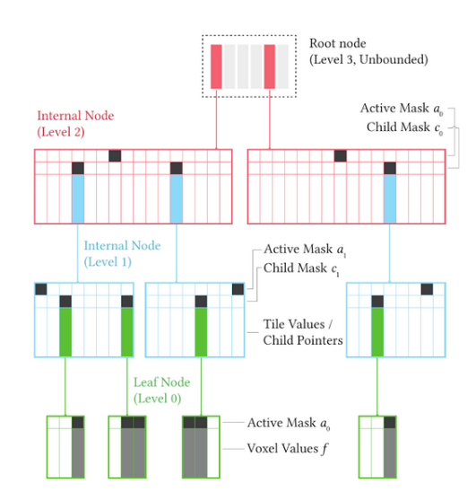
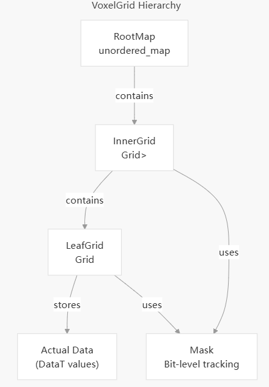
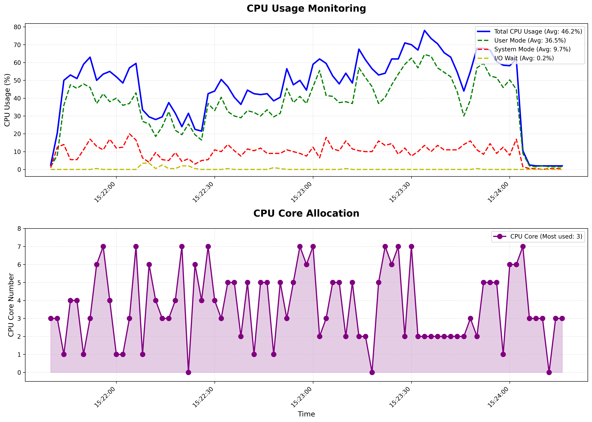
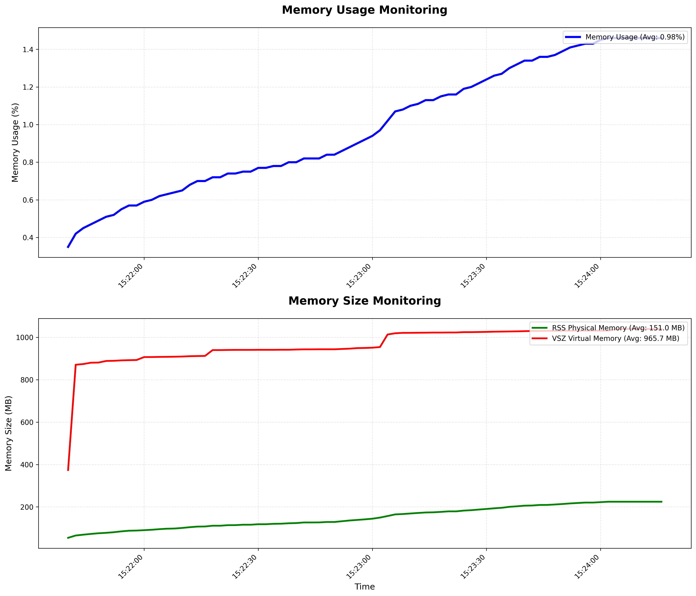
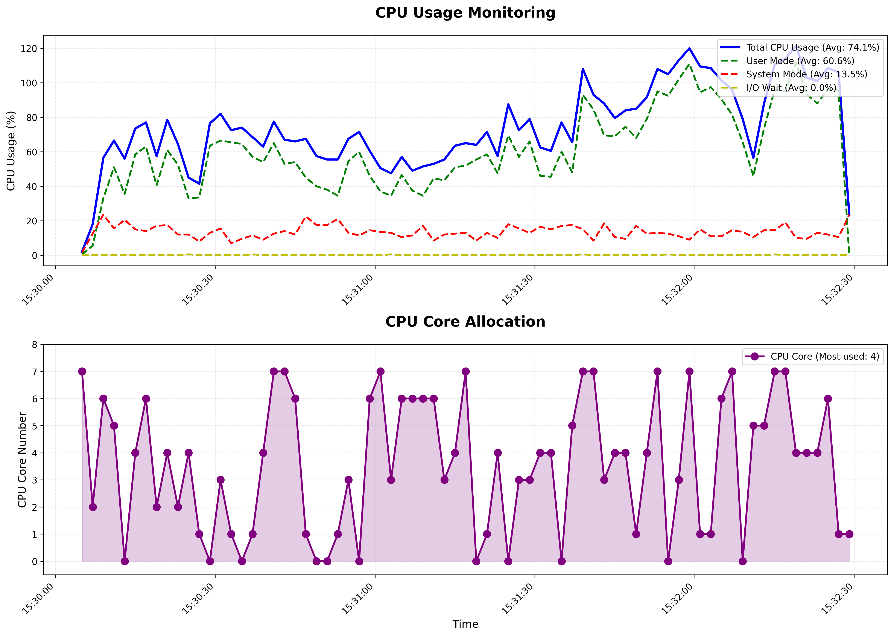
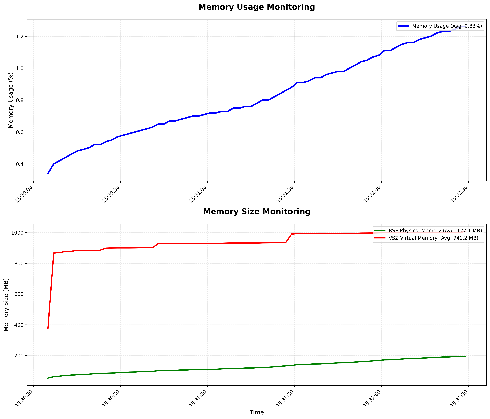

# VDB数据结构

VDB的核心是一个**分层的动态数据结构**，它基于B+树和Octree（八叉树）等概念的扩展，被称为 VDB (Volume Data Block)，最开始由梦工厂动画公司 (DreamWorks Animation, DWA)开发，当前由Academy Software Foundation维护[openvdb](https://github.com/AcademySoftwareFoundation/openvdb)。具有以下特点：

- **层次结构:** 它由一个**根节点**（root_grid）、多个**内部节点**（inner_grid）和**叶节点**（leaf_grid）组成。这种层次结构允许它只存储和操作那些包含实际体积数据的区域（非空体素，Voxel），而跳过大量的空闲空间。

- **高效性:** 这种结构提供了以下优点：
  - **紧凑存储:** 大大减少了存储体积所需的内存，因为它不存储空闲空间。
  
  - **快速访问:** 提供了对高分辨率稀疏体积数据的快速随机访问。
  
  - **动态拓扑:** 能够有效地处理体积数据随时间变化（例如火焰和烟雾的流动、形状变化）所需的动态变化。
  
- **几乎无限的索引空间:** 它能够支持对高分辨率稀疏体积数据的处理，模拟出一个几乎无限的三维索引空间。

VDB分为三层从上到下为root-inner-leaf，具体如下：



## Bonxai

openvdb对于机器人领域较为复杂，这里采用[Bonxai](https://github.com/facontidavide/Bonxai)实现的vdb继续说明：



Bonxai和原版的openvdb实现存在差异，固定使用三层结构：

```bash
RootMap (unordered_map)  
  └─> InnerGrid (Grid<shared_ptr<LeafGrid>>)  
       └─> LeafGrid (Grid<DataT>)  
            └─> 实际数据  
```

其中RootMap层使用哈希表，InnerGrid LeafGrid 层使用 `Grid<DataT>` 类，内部是连续数组 (`DataT* data_`) 加上位掩码 (`Mask`) 。

Bonxai提供的操作接口不多，主要使用`accessor`进行数据的增加、获取和修改，本身不提供数据的删除，但可以通过`setOff`进行禁用，后续通过`releaseUnusedMemory`遍历删除对应数据，不过耗时较高。

# IVDB

## IVOX分析

IVOX为voxel-like地图，使用**稀疏结构+LRU**实现最优的效率和内存管理，这种方案应该是当前最优的地图方案。

IVOX本身在不同场景下存在一些小问题：

- voxel内部并没有进行点的管理，`capacity_`只是控制voxel的数量，voxel内部点没有进行处理，过多的点会到来效率的下降，但是如果不是长时间对着小空间范围移动，其实影响不大。
- 基于NearbyType搜索最近点， 因此其查找范围为一个`resolution_`，`GetClosestPoint`中的`max_range`其中作用不大，实际测下来NEARBY18和NEARBY26效果差别不大，强行增大`resolution_`或者增加NearbyType为124提高搜索最近点范围并不一定提高LIO精度，反而有可能导致下降，因此这个只是理论上存在问题，实际上不存在。
- 使用PHC模式时，`AddPoints`的速度会比线性模式下慢。

## 设计思路

IVDB沿用IVOX方案，一样采用**稀疏结构+LRU**，主要是将哈希表换成了VDB，leaf_grid作为最小单位（经测试，resolution不能设置太小，否则创建太多的leaf_grid会导致效率大幅度下降），同时增加了最近点查找和LRU的实现，具体优化如下：

- 增加点效率优化

  使用VDB代替了哈希表，同时对grid内的点进行有策略地限制，限制策略参考rko-lio的处理，只保留距离grid内现有点大于map_resolution的点。

  ```cpp
  if (voxel_points->size() == max_points_per_voxel_ || std::any_of(voxel_points->cbegin(), voxel_points->cend(),[&](const auto& voxel_point) { return (voxel_point - p).norm() < map_resolution; })) {
        return;
  }
  ```

- 最近点查找优化

  搜索的最大范围基于Nearby和resolution确定，减少判断，Nearby26时最大查找距离为[-resolution,resolution]，支持NEARBY18，NEARBY26，NEARBY124，其中NEARBY124首先查找NEARBY26，若满足max_num，则不再进行搜索。

  Bonxai中`posToCoord`使用`std::floor`进行近似，ivox中使用`std::round`进行近似，因此修改Bonxai统一为`std::round`，这样在一样的NEARBYTYPE下，最近点结果才能一致。

- LRU实现

  LRU处理在root_grid层级，因为在inner_grid和leaf_grid层级使用了不同的数据结构，若在leaf_grid这个层级进行滑动删除，代码设计较为复杂，同时耗时较大，因此这里的`capacity_`为root_key最大数量，一个root_grid大小为`resolution*2^(inner_bits+leaf_bits)`。
  
  ```cpp
    std::list<Bonxai::CoordT> lru_cache_;
    std::unordered_map<Bonxai::CoordT, std::list<Bonxai::CoordT>::iterator> lru_map_;
  ```

## 性能测试

测试程序 `vox_comparison` ，主要对比了两种不同的体素（Voxel）地图数据结构在处理三维点云数据时的性能，对比的重点在于点云的**插入时间**和**最近邻搜索效率**。

> 因为点云为随机生成，每次测试结果都有点不一样

### x86平台

测试环境：Ubuntu 22.04，ivox使用线性模式+NEARBY18，ivdb使用线性模式+NEARBY26

```bash
Performance comparison between iVox and Sparse Voxel Grid
Generated mapping point cloud with obstacles with dimensions: 100 x 100 x 100 (total: 299648 points)
Actual resolution: 0.5 x 0.5 x 0.5
Generating 1000 query points...

--- Testing iVox ---
iVox insertion time: 730 ms for 299648 points
iVox number of valid grids: 299648
iVox nearest neighbor search time: 16 ms for 1000 queries
iVox found closest points for: 14 / 1000 queries

--- Testing Sparse Voxel Grid ---
iVdb insertion time: 229 ms for 299648 points
Sparse number of Pointcloud: 299648
iVdb nearest neighbor search time: 1 ms for 1000 queries
iVdb found closest points for: 14 / 1000 queries

--- Summary ---
Insertion Performance:
  iVox: 730 ms
  iVdb: 229 ms

Nearest Neighbor Search Performance:
  iVox: 16 ms
  iVdb: 1 ms

Efficiency Comparison:
  Insertion: iVdb is 3.18777x faster
  NN Search: iVdb is 16x faster
```

### ARM平台

测试环境：jetson-orin-nx-16g，Ubuntu 22.04，ivox使用线性模式+NEARBY18，ivdb使用线性模式+NEARBY26

```bash
Performance comparison between iVox and Sparse Voxel Grid
Generated mapping point cloud with obstacles with dimensions: 100 x 100 x 100 (total: 299648 points)
Actual resolution: 0.5 x 0.5 x 0.5
Generating 1000 query points...

--- Testing iVox ---
iVox insertion time: 1119 ms for 299648 points
iVox number of valid grids: 299648
iVox nearest neighbor search time: 26 ms for 1000 queries
iVox found closest points for: 13 / 1000 queries

--- Testing Sparse Voxel Grid ---
iVdb insertion time: 329 ms for 299648 points
Sparse number of Pointcloud: 299648
iVdb nearest neighbor search time: 2 ms for 1000 queries
iVdb found closest points for: 13 / 1000 queries

--- Summary ---
Insertion Performance:
  iVox: 1119 ms
  iVdb: 329 ms

Nearest Neighbor Search Performance:
  iVox: 26 ms
  iVdb: 2 ms

Efficiency Comparison:
  Insertion: iVdb is 3.40122x faster
  NN Search: iVdb is 13x faster
```

### faster-lio

测试环境：jetson-orin-nx-16g，Ubuntu 22.04，ivox使用线性模式+NEARBY18，ivdb使用线性模式+NEARBY26

数据集：outdoor_Mainbuilding_10hz_2020-12-24-16-38-00.bag

测试结果：ivdb相对于ivox，IEKF Solve and Update计算耗时下降接近一半，CPU占用有较为明显下降，数据小，内存占用区别不明显，大数据集下ivdb比ivox小一点。

- ivdb

  ```bash
  I1114 11:07:44.505065  9959 utils.h:52] >>> ===== Printing run time =====
  I1114 11:07:44.505075  9959 utils.h:54] > [     IVox Add Points ] average time usage: 0.149114 ms , called times: 1411
  I1114 11:07:44.505102  9959 utils.h:54] > [     Incremental Mapping ] average time usage: 0.435405 ms , called times: 1411
  I1114 11:07:44.505111  9959 utils.h:54] > [     ObsModel (IEKF Build Jacobian) ] average time usage: 0.0611653 ms , called times: 5641
  I1114 11:07:44.505127  9959 utils.h:54] > [     ObsModel (Lidar Match) ] average time usage: 0.607401 ms , called times: 5641
  I1114 11:07:44.505141  9959 utils.h:54] > [ Downsample PointCloud ] average time usage: 0.760394 ms , called times: 1411
  I1114 11:07:44.505149  9959 utils.h:54] > [ IEKF Solve and Update ] average time usage: 4.19231 ms , called times: 1411
  I1114 11:07:44.505158  9959 utils.h:54] > [ Preprocess (Livox) ] average time usage: 0.654761 ms , called times: 1414
  I1114 11:07:44.505167  9959 utils.h:54] > [ Undistort Pcl ] average time usage: 2.57588 ms , called times: 1412
  I1114 11:07:44.505174  9959 utils.h:59] >>> ===== Printing run time end =====
  ```

  

  

- ivox

  ```bash
  I1023 11:27:01.641669 15384 utils.h:52] >>> ===== Printing run time =====
  I1023 11:27:01.641678 15384 utils.h:54] > [     IVox Add Points ] average time usage: 0.239232 ms , called times: 1411
  I1023 11:27:01.641708 15384 utils.h:54] > [     Incremental Mapping ] average time usage: 0.587766 ms , called times: 1411
  I1023 11:27:01.641718 15384 utils.h:54] > [     ObsModel (IEKF Build Jacobian) ] average time usage: 0.0758585 ms , called times: 5641
  I1023 11:27:01.641736 15384 utils.h:54] > [     ObsModel (Lidar Match) ] average time usage: 1.45841 ms , called times: 5641
  I1023 11:27:01.641752 15384 utils.h:54] > [ Downsample PointCloud ] average time usage: 0.905352 ms , called times: 1411
  I1023 11:27:01.641762 15384 utils.h:54] > [ IEKF Solve and Update ] average time usage: 8.07555 ms , called times: 1411
  I1023 11:27:01.641772 15384 utils.h:54] > [ Preprocess (Livox) ] average time usage: 0.714139 ms , called times: 1414
  I1023 11:27:01.641779 15384 utils.h:54] > [ Undistort Pcl ] average time usage: 3.12194 ms , called times: 1412
  I1023 11:27:01.641808 15384 utils.h:59] >>> ===== Printing run time end =====
  ```

​	



## 拓展

- VDB支持不同的数据结构，可以用于保存带有RGB信息的point或者图像特征点，拓展于VIO使用。
- VDB不支持多分辨率，这会导致一定的局限性。

# 参考

- 网上资料
  - [OpenVDB简介](https://cloud.tencent.com/developer/article/2197787)
  - [科研日记 | openvdb cookbook 阅读笔记](https://zhuanlan.zhihu.com/p/23099244893)
  - [Rolling-Bonxai滚动更新地图技术详解](https://www.guyuehome.com/detail?id=1969028886853349377)
  - [Optimizing Large-Scale Sparse Volumetric Data with NVIDIA NeuralVDB Early Access](https://developer.nvidia.com/blog/optimizing-large-scale-sparse-volumetric-data-with-nvidia-neuralvdb-early-access/)
  
- 开源库

  - [openvdb](https://github.com/AcademySoftwareFoundation/openvdb)
  - [Bonxai](https://github.com/facontidavide/Bonxai)
